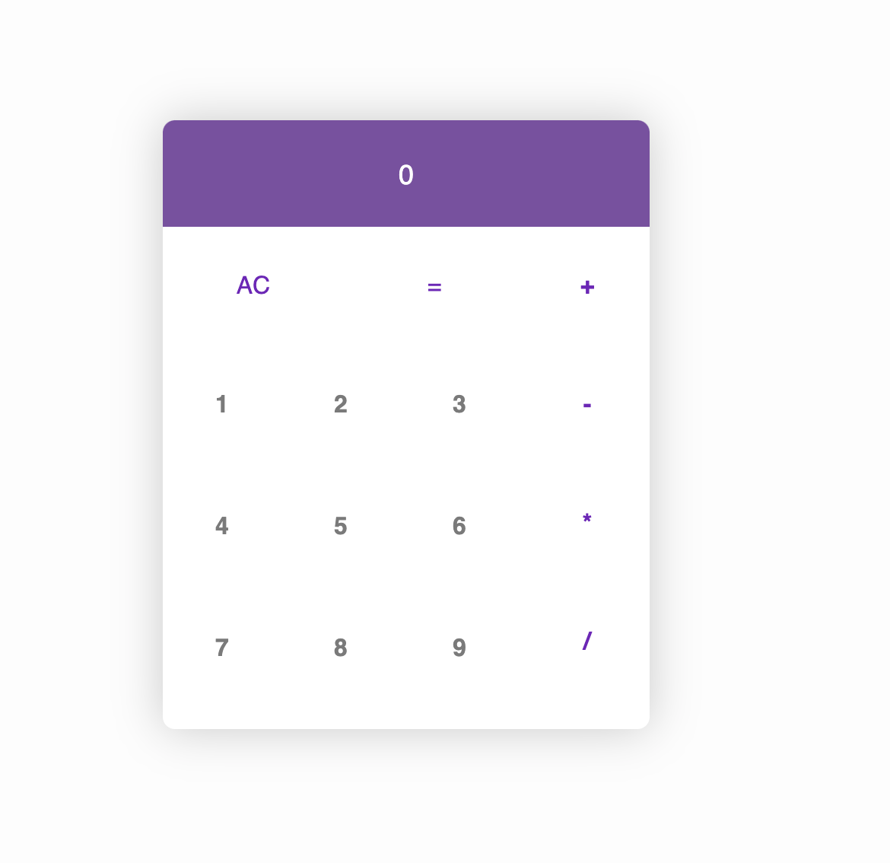

# Simple Calculator
 

## :computer: Project
This project is a simple calculator, the principal tecnology that i used was react. This project is very good for learning more and if you are beginner.

## :fire: Instalation
- clone the repository: `git clone`
- enter the folder: `cd calculator-react`
- start the server: `yarn start`

- Runs the app in the development mode.\
Open [http://localhost:3000](http://localhost:3000) to view it in the browser.

